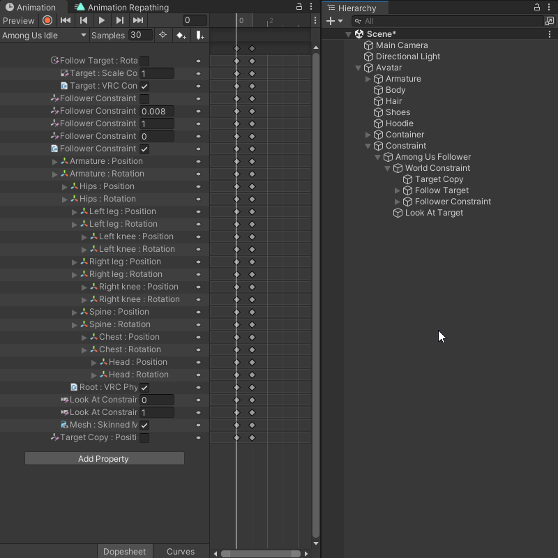

import { Steps } from '@astrojs/starlight/components';

Automatic Repathing allows you to instantly update your Animations property paths to reflect your Hierarchy as you move around and rename GameObjects.

## How to use

<Steps>
1. Define the Animator Controller that you want to use for the Automatic Repathing tool in the [General Settings](/animation-repathing/settings/#general-settings).

   
   
2. Enable the Automatic Repathing tool by clicking the toggle at the top of the window.

   

3. Move or rename GameObjects in the Hierarchy, the tool will automatically update the paths in your Animations.
</Steps>

:::caution

The Automatic Repathing tool can not fix paths that are already broken before enabling it. Use the [Fix Invalid Paths](/animation-repathing/fix-invalid/) tool first before using the Automatic Repathing tool or your paths will not be updated.

:::