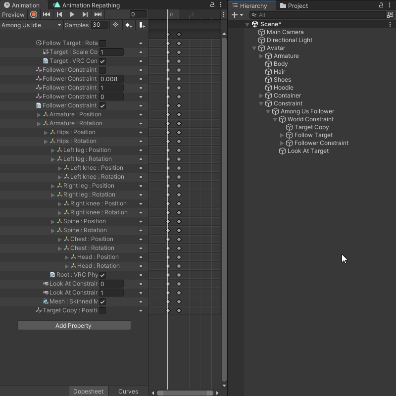
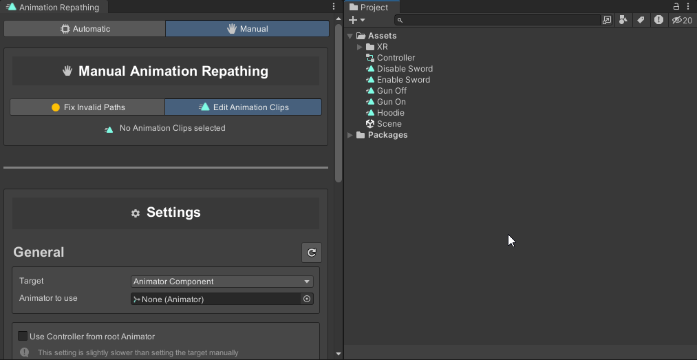
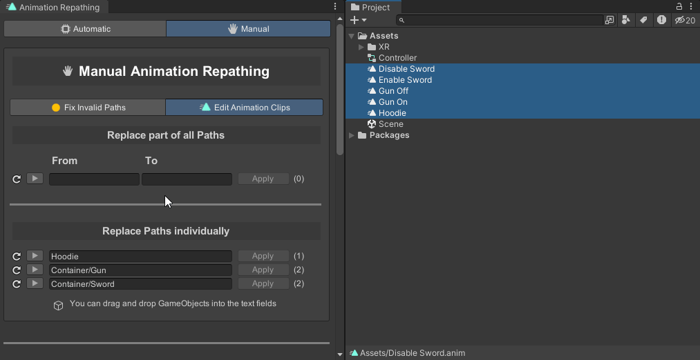
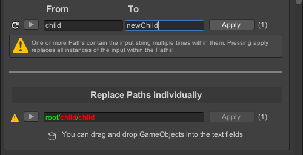
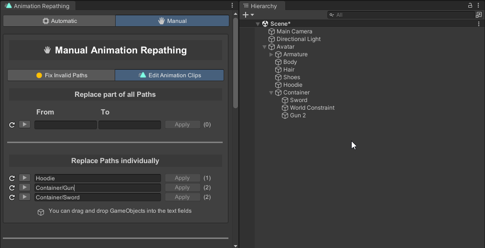
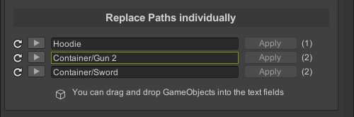

import { Steps } from '@astrojs/starlight/components';
import { Tabs, TabItem } from '@astrojs/starlight/components';
import { Aside } from '@astrojs/starlight/components';

Edit Animation Clips allows you to directly edit the property paths of selected Animation Clips. You can edit property paths either individually or in bulk.

## How to use

<Tabs>
  <TabItem label="Individual">
    <Steps>
      1. Select the Animation Clips you want to edit. All the property paths of the selected Animations will be displayed in the window.

         

      2. Input the new property path into the text field and click ``Apply`` to update the property path for all affected Animatons.

    </Steps>
    <Aside type="note">
      When pressing ``Apply`` the text fields of all other property paths will reset to their original value. Its best to update property paths one at a time.
    </Aside>
  </TabItem>
  <TabItem label="Multiple">
    <Steps>
      1. Select the Animation Clips you want to edit. All the property paths of the selected Animations will be displayed in the window.

         

      2. Input the part of the path you want to replace in the ``From`` text field and the new path in the ``To`` text field.

         

          :::tip
          The tool will highlight affected paths green, the parts that will be updated in blue and multiple instances in red.  
          Property paths that are unaffected will be greyed out.
          :::

      3. Click ``Apply`` to replace the ``From`` path with the ``To`` path for all selected Animations.

    </Steps>
    <Aside type="danger">
      If the ``From`` path is contained multiple times in the property path, all instances will be replaced!  
      For example, if the property path is ``root/child/child`` and you replace ``child`` with ``newChild``, the new path will be ``root/newChild/newChild``.

      

      To avoid this, make sure the ``From`` path is unique!
    </Aside>
  </TabItem>
</Tabs>

## Additional Features

- You can drag and drop GameObjects from the Hierarchy into the text field to automatically fill in the property path.

  

- If you have an Animator Controller defined in your settings, it will scan the Animator Controller for any invalid property paths and outline them yellow.

  
