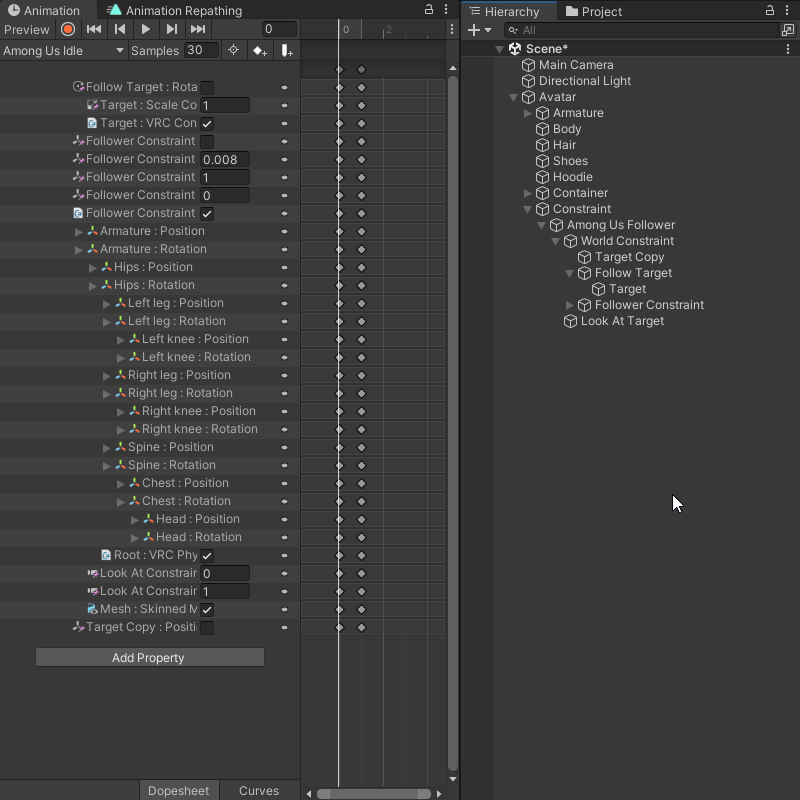

import { Steps } from '@astrojs/starlight/components';

Fix Invalid Paths scans all Animations in your Animator Controllers for invalid property paths, allowing you to quickly fix them.

## How to use

<Steps>
1. Define the Animator Controller that you want to use for the Automatic Repathing tool in the [General Settings](/animation-repathing/settings/#general-settings).

   
   
2. Click the refresh button to scan all Animations in your Animator Controllers for invalid property paths.

   

   :::note
   The tool will also display paths that point at a property that no longer exists, even if the path is valid.  
   For example, if you animate a Parent Constraint on a GameObject and then delete the Parent Constraint, the path will be invalid, even if the path was never changed.
   :::

3. Input the new property path into the text field and click ``Apply`` to update the property path for all Animatons

   :::note
   When pressing ``Apply`` the text fields of all other invalid paths will reset to their original value. Its best to update invalid paths one at a time.
   :::

</Steps>

## Additional Features

- You can drag and drop GameObjects from the Hierarchy into the text field to automatically fill in the property path.

   