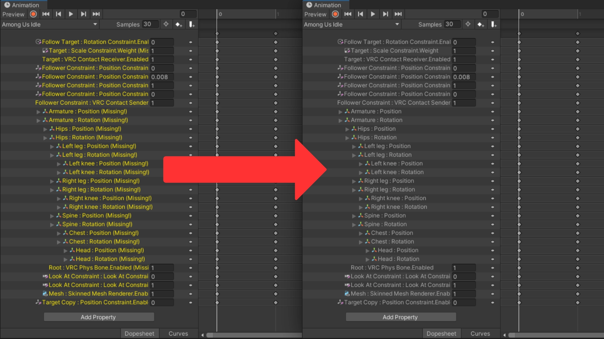

import { Card, CardGrid } from '@astrojs/starlight/components';
import { AnimationRepathingData } from '../../../components/AnimationRepathingData.astro';

Animation Repathing is a Unity Editor tool to help users automatically or manually change the paths of properties inside an Animation Clip.  
This tool is useful if you often find yourself moving and renaming GameObjects in your Hierarchy, and you want to quickly update the Animation Clips that reference them.



<CardGrid>
  <Card title="Downloads" icon="seti:markdown">
    <p id="downloads">---</p>
  </Card>
  <Card title="Users" icon="seti:bazel">
    <p id="users">---</p>
  </Card>
  <Card title="Projects" icon="rocket">
    <p id="projects">---</p>
  </Card>
    <Card title="Changed Paths" icon="pencil">
    <p id="paths">---</p>
  </Card>
</CardGrid>

## Installation

You can download the latest version on [GitHub](https://github.com/hfcRed/Animation-Repathing/releases/tag/v0.5.4) or add it to your [VRChat Creator Companion](https://github.com/hfcRed/Animation-Repathing/releases/latest).  
The tool can be opened from the Unity Editor menu bar under `hfcRed > Tools > Animation Repathing`.

## Support

If you encounter any problems or need help with the package dont hesitate to shoot me a message on Discord: hfcRed

## License

```text
MIT License

Copyright (c) 2023 hfcRed

Permission is hereby granted, free of charge, to any person obtaining a copy
of this software and associated documentation files (the "Software"), to deal
in the Software without restriction, including without limitation the rights
to use, copy, modify, merge, publish, distribute, sublicense, and/or sell
copies of the Software, and to permit persons to whom the Software is
furnished to do so, subject to the following conditions:

The above copyright notice and this permission notice shall be included in all
copies or substantial portions of the Software.

THE SOFTWARE IS PROVIDED "AS IS", WITHOUT WARRANTY OF ANY KIND, EXPRESS OR
IMPLIED, INCLUDING BUT NOT LIMITED TO THE WARRANTIES OF MERCHANTABILITY,
FITNESS FOR A PARTICULAR PURPOSE AND NONINFRINGEMENT. IN NO EVENT SHALL THE
AUTHORS OR COPYRIGHT HOLDERS BE LIABLE FOR ANY CLAIM, DAMAGES OR OTHER
LIABILITY, WHETHER IN AN ACTION OF CONTRACT, TORT OR OTHERWISE, ARISING FROM,
OUT OF OR IN CONNECTION WITH THE SOFTWARE OR THE USE OR OTHER DEALINGS IN THE
SOFTWARE.
```
