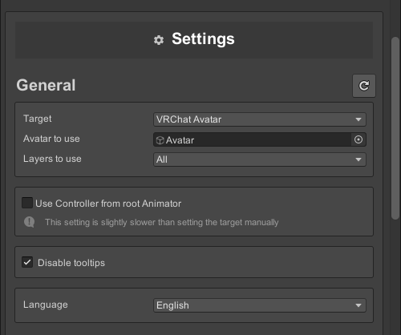
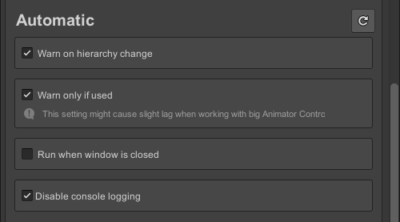

## General Settings

- **Target**  
Where the tool will get the Animator Controller from. This can be either an [Animator Component](https://docs.unity3d.com/Manual/class-Animator.html) or a [Avatar Descriptor](https://creators.vrchat.com/avatars/creating-your-first-avatar/#step-5---adding-an-avatar-descriptor).

- **Animator/Avatar to use**  
The GameObject containing the Animator Component or Avatar Descriptor.

- **Layers to use**  
This setting will only appear when using a VRChat Avatar. You can select which of the Avatars [Playable Layers](https://creators.vrchat.com/avatars/playable-layers/) the tool should or should not target.

- **Use Controller from root Animator**  
This setting will disable the above mentioned settings and automatically find an Animator Component in one of the parents whenever a GameObject is selected in the Hierarchy.

- **Disable tooltips**  
Prevent tooltips from showing up when hovering over elements in the window.

- **Language**  
Change the language of the text. Can choose between English, Japanese and Korean.

## Automatic Settings

- **Warn on hierarchy change**  
Whether the tool should open a warning popup whenever any changes in the Hierarchy are made.

- **Warn only if used**  
When enabled, the tool will only open a warning popup if the affected GameObject was used in any Animations.

- **Run when window is closed**  
Allows the tool to continue working even if the Animation Repathing window is closed.

- **Disable console logging**  
Prevent the tool from logging the old and new property path in the console whenever a property path changes.
