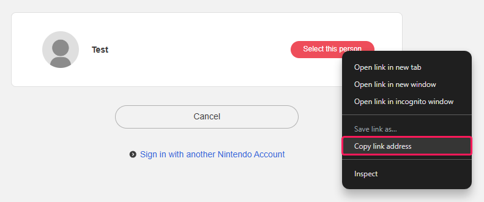

import { Steps } from '@astrojs/starlight/components';

Before you can start performing queries to the NSO servers, you need to aquire a session token. This token is used to generate the necessary parameters for the service you want to query.

There are three steps to aquire a session token:

<Steps>
1. **Authorization link**
   
    Generate an authorization link and verifier from the [Authorization Link](/nso/authorization/link) endpoint.

    Response:
    ```json
    {
        "error": false,
        "data": {
            "link": "https://accounts.nintendo.com/connect/1.0.0/authorize...",
            "verifier": "12345"
        }
    }
    ```
2. **Login link**

    Open the authorization link and right click ``Select this person`` to copy the login link.

    

    :::note
    This step should never be automated. The user needs to manually copy the link to ensure informed consent.
    :::

3. **Session token**

    Use the login link together with the verifier from step 1 to generate a session token from the [Generate Token](/nso/authorization/sessiontoken) endpoint.

    Request body:
    ```json
    {
        "loginLink": "npf71b963c1b7b6d119://auth#session_token_code...",
        "verifier": "12345"
    }
    ```

    Response:
    ```json
    {
        "error": false,
        "data": {
            "sessionToken": "eyJhbGciOiJIUzI1NiJ9..."
        }
    }
    ```
</Steps>
